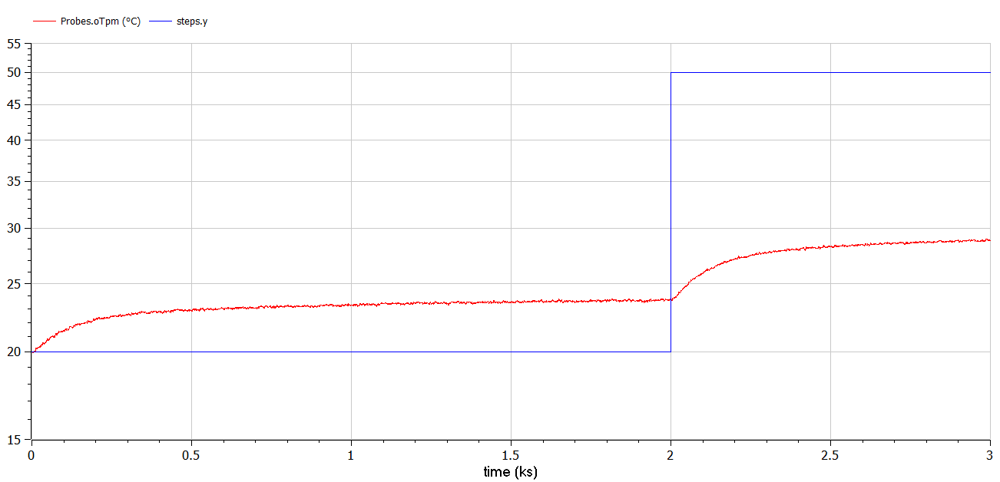

# Parte 1: Scalino

## Obiettivo

modello per controllare la temperatura della piastrina ($T_p$) agendo sul comando al transistor 1 ($Q_1$) e considerando il comando al transiostor 2 come un disturbo ($Q_2)$.

## Modelica


**Verifica della stabilità del sistema in risposta allo scalino**

### Setup dello scalino:

- Ampiezza: `30%`

- Istante di tempo: `2000`


### Simulazione: 




**Parametri mostrati nel grafico:**


**File output:**


## Matlab

### Obiettivo

Trovare la funzione di trasferimento che meglio descrive il sistema simulato


<p align="center"></p>

$4,15$ valore da trovare sul grafico

Si può ricavare:

<p align="center"></p>

- **Primo ordine**

<p align="center"></p>

<p align="center"></p>


``` matlab
mu = 4.15/30;
T1 = 620/5;

M1 = tf(mu, [T1 1]);

plot(t, Tp, 'b', t, 30*step(M1, t), 'r');
grid;
```

- **Secondo ordine**

<p align="center"></p>

$T_2$ con valore arbitrario ($T_2 \ll T_1$)


``` matlab
T2 = 10;

M2 = tf(mu, conv([T1 1], [T2 1]));

plot(t, Tp, 'b', t, 30*step(M2, t), 'r');
grid;
```

- **Terzo ordine e uno zero**

<p align="center"></p>

$T_3$ con valore arbitrario ($T_3 \ll T_2$)

$T_z$ con valore arbitrario ($|T_3| < |T_z| < |T_2|$)


``` matlab
Tz = 5;
T3 = 2;

M3 = tf(mu * [Tz 1], conv(conv([T1 1], [T2 1]), [T3 1]));

plot(t, Tp, 'b', t, 30*step(M2, t), 'r');
grid;
```

---

# Parte 2: Sinusoide

## Modelica

### Setup Sinusoide


### Simulazione

(Stop time 12000 → sinusoide non interferisce con scalino)


**Parametri mostrati nel grafico:**


## Matlab

``` matlab
clear all
close all
clc

data = csvread('sen.csv', 1);

start = find(data(:,1) == 8000);
stop = find(data(:,1) == 10000);
t = data(start:stop, 1);
Q1 = data(start:stop, 2);
Tp = data(start:stop, 6);

t = t - t(1)
Tp = Tp - mean(Tp);
Q1 = Q1 - 30;

plot(t, Q1, 'b', t, 10*Tp, 'r');
grid;
```


- Calcolare punti della risposta dal grafico

- frequenza della risposta

$T$ periodo del segnale sinusoidale

<p align="center"></p>

- modulo della risposta

<p align="center"></p>

dove $\textnormal{peak}$ è il picco della risposta misurato dal grafico (riscalato di $10$ per visibilità sul grafico)

- fase della risposta

<p align="center"></p>

Dove $\Delta t$ è il tempo che trascorre tra un picco della sinusoide e uno della riposta (per $240$ è $(1020-1070)$)

Codice:

``` matlab
%% Risposta alla prima frequenza (T=240s)
w1 = 2*pi/240;
m1 = 8.2/20/10;
p1 = (1020-1073)/240 * 360;

%% Risposta alla seconda frequenza (T=120s)
w2 = 2*pi/120;
m2 = 3.7/20/10;
p2 = (1710-1746)/120 * 360;

%% Risposta alla terza frequenza (T=60s)
w3 = 2*pi/60;
m3 = 1.2/20/10;
p3 = (2055-2076)/60 * 360;
```

- Calcolare la risposta in frequenza dei modelli calcolati in precedenza (risposta allo scalino)

Codice:

``` matlab
mu = 4.15/30;
T1 = 620/5;
M1 = tf(mu, [T1 1]);

T2 = 10;
M2 = tf(mu, conv([T1 1], [T2 1]));

Tz = 5;
T3 = 2;
M3 = tf(mu * [Tz 1], conv(conv([T1 1], [T2 1]), [T3 1]));


w = logspace(-3, 0);
[mM1, pM1] = bode(M1, w);
[mM2, pM2] = bode(M2, w);
[mM3, pM3] = bode(M3, w);

mM1_dB = 20*log10(mM1(:));
pM1 = pM1(:);

mM2_dB = 20*log10(mM2(:));
pM2 = pM2(:);

mM3_dB = 20*log10(mM3(:));
pM3 = pM3(:);
```

- Plottare i diagrammi di bode delle risposte appena calcolate e vedere quale dei tre si avvicina meglio ai punti misurati

Codice:

``` matlab
wp = [w1, w2, w3];
mp_db = 20*log10([m1, m2, m3]);
pp = [p1 p2 p3];

subplot(211);
semilogx(w, mM1_dB, 'b', w, mM2_dB, 'g', w, mM3_dB, 'r', wp, mp_dB, 'ok');
legend('primo ordine', 'secondo ordine', 'terzo ordine con zero');

subplot(212);
semilogx(w, pM1, 'b', w, pM2, 'g', w, pM3, 'r', wp, pp, 'ok');
legend('primo ordine', 'secondo ordine', 'terzo ordine con zero');
```


Si nota che l’approssimazione più corretta è quella rossa, ma è ancora migliorabile:

``` matlab
%%  Modello migliore rispetto al dominio delle frequenze
M4 = tf(mu * [4 1],conv(conv([110 1],[12 1]),[2 1]));

[mM4,pM4] = bode(M4,w);
mM4_dB = 20*log10(mM4(:));
pM4 = pM4(:);

subplot(211);
semilogx(w, mM3_dB, 'r', w, mM4_dB, 'b', wp, mp_dB, 'ok');
subplot(212);
semilogx(w, pM3, 'r', w, pM4, 'b', wp, pp, 'ok');
legend('M3','M4');
```


Purtroppo però il modello ottimizzato per risposta in frequenza (`M4`) approssima male la risposta allo scalino.

**Il modello perfetto non c'è perché nessuna delle necessarie ipotesi semplificative è a rigore vera**

**Quale scelgo?**

Dipende:

- Un modello identificato nel solo dominio del tempo mira a riprodurre bene i dati da cui è tratto e non è in generale particolarmente preciso in nessuna banda.

- Un modello identificato badando anche al dominio della frequenza può essere reso preciso nella banda desiderata, a patto di avere dati in quella banda: questo può essere molto utile per la sintesi del controllo.

