# Sintesi del regolatore

## Scopo

sintetizzare, simulare e provare sperimentalmente diversi regolatori di temperatura per l'apparato termico sperimentale, confrontando i risultati ottenuti e commentando il tutto alla luce delle competenze apprese nel corso.

---

## Regolatore R1

`R1` del tipo PI:

<p align="center"></p>

Per ottenere un tempo di assestamento `Ta=120s` , occorre definire la pulsazione critica $\omega_c$: 

<p align="center"></p>

Per la sintesi di `R1` (facendo riferimento a `M1`) si pone `Ti = T1`, in modo che lo zero del regolatore cancelli il polo del modello.

Si ottiene quindi la funzione di trasferimento ad anello

<p align="center"></p>

La cui pulsazione critica vale 

<p align="center"></p>

da cui

<p align="center"></p>

``` matlab
Ti = 130;
wc = 5/120;
K = wc * Ti/mu;
R1 = K * (1 + tf(1, [Ti 0]));
step(R1*M1 / (1 + R1*M1), 150);
```

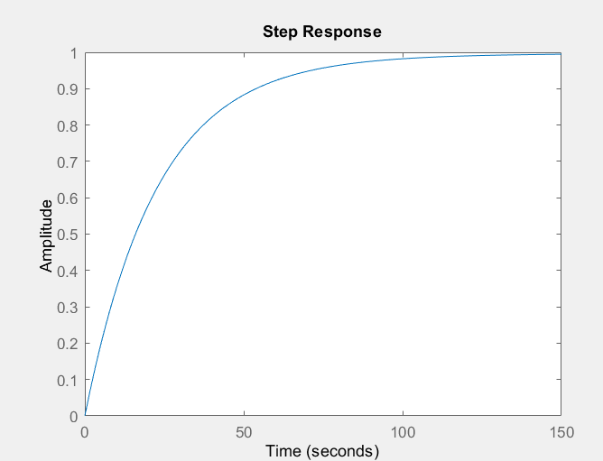

Valutazione di pulsazione critica e margine di fase nei 4 modelli:

``` matlab
[gm,pm,wu,wc]=margin(R1*M1);
disp([wc,pm])
[gm,pm,wu,wc]=margin(R1*M2);
disp([wc,pm]) 
[gm,pm,wu,wc]=margin(R1*M3);
disp([wc,pm])
[gm,pm,wu,wc]=margin(R1*M4);
disp([wc,pm])
```

``` bash
0.0436   90.4735

0.0404   68.4966

0.0410   75.0917

0.0438   68.9616
```

Simulazione dei modelli in risposta a PV e CS

``` matlab
subplot(211);
F1 = R1*M1/(1+R1*M1); % funzione di sensitività complementare
F2 = R1*M2/(1+R1*M2);
F3 = R1*M3/(1+R1*M3);
step(F1, F2, F3, 150);
legend('M1','M2','M3');

subplot(212);
step(R1/(1+R1*M1),R1/(1+R1*M2),R1/(1+R1*M3),150);
legend('M1','M2','M3');
```

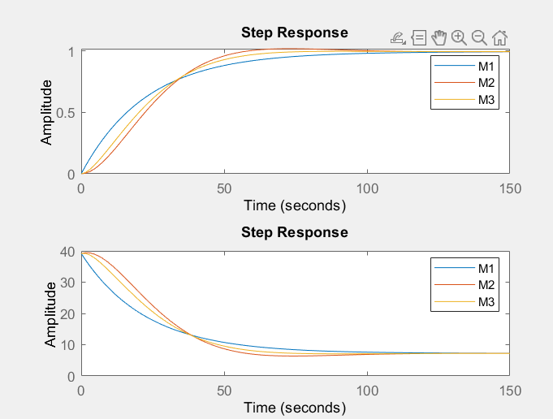

### Valutazione della risposta in frequenza 

``` matlab
bode(M1, M2, M3, M4);
legend('M1','M2','M3', 'M4');
```

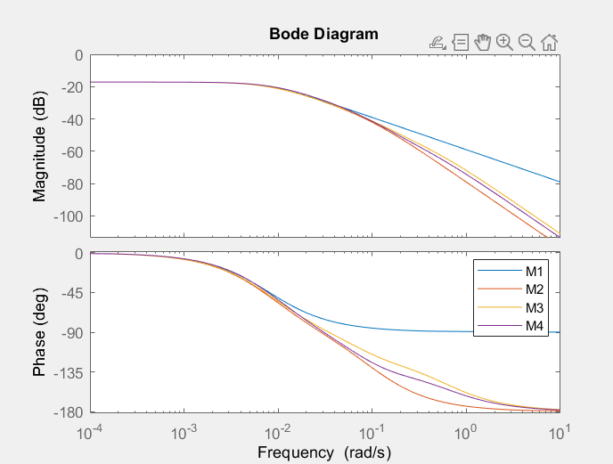

si nota che i modelli sono equivalenti solo per pulsazioni fino a $0.005 \textnormal{ rad/s}$,
quindi per ottenere risposte uguali in tutti i modelli bisogna scegliere $\omega_c < 0.005 \textnormal{ rad/s}$

## Regolatore R2

<p align="center"></p>

``` matlab
wc = 0.005;
K2 = wc * Ti/mu;
R2 = K2 * (1 + tf(1, [Ti 0]));
```

Il tempo di assestamento $Ta $ del regolatore sarà ora

<p align="center"></p>

invece dei $120s$ desiderati.

Simulazione dei modelli in risposta a PV e CS

``` matlab
subplot(211);
step(R2*M1/(1+R2*M1),R2*M2/(1+R2*M2),R2*M3/(1+R2*M3),1000);
legend('M1','M2','M3');

subplot(212);
step(R1/(1+R2*M1),R2/(1+R2*M2),R2/(1+R2*M3),1000);
legend('M1','M2','M3');
```

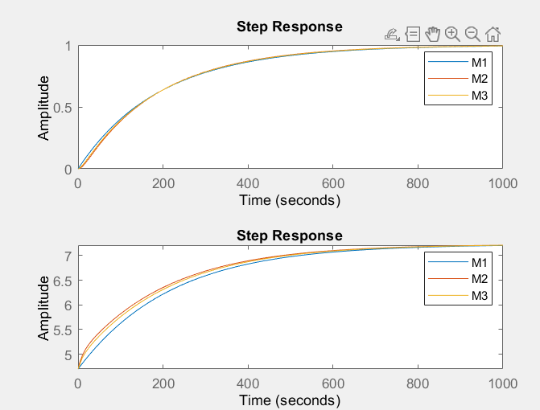

Si possono anche usare modelli grossolani, ma si può fidarsene solo in bassa frequenza e bisogna ridurre quindi le prestazioni richieste.

Per ottenere prestazioni migliori servono modelli affidabili anche ad alte frequenze.

## Regolatore R2

Si richiede una banda di controllo che si estende a pulsazioni dove `M1` non è più affidabile.

ad esempio

<p align="center"></p>

``` matlab
wc = 0.5;
K3 = wc * Ti/mu;
R3 = K3 * (1 + tf(1, [Ti 0]));

clf;
subplot(211);
step(R3*M1/(1+R3*M1),R3*M2/(1+R3*M2),R3*M3/(1+R3*M3),50);
legend('M1','M2','M3');

subplot(212);
step(R3/(1+R3*M1),R3/(1+R3*M2),R3/(1+R3*M3),50);
legend('M1','M2','M3');
```

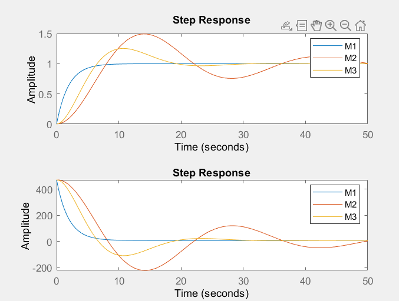

Si vede che le simulazioni con `M1` non descrivono in maniera adeguata il comportamento del sistema

## Regolatore R4

Regolatore PID (reale) usando un modello migliore (`M2`)

<p align="center"></p>

Si sintetizza `R4` im modo che la FDT ad anello abbia forma 

<p align="center"></p>

per ottenere

<p align="center"></p>

`R4` è quindi

<p align="center"></p>

``` matlab
R4=1/M2 * tf(1,conv([10 0],[2 1]));
clf;
margin(R4 * M2);
```

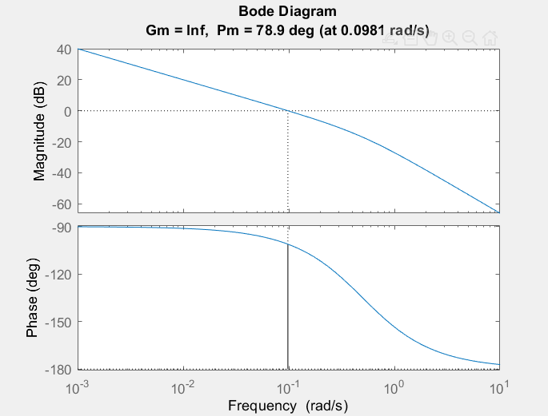

Si deve ora esprimere `R4` nella foma *ISA*

<p align="center"></p>

I valori possono così essere ricavati:

<p align="center"></p>

da cui

<p align="center"></p>

`R4` scritto in forma ISA è

<p align="center"></p>

Si può vedere che le due forme coincidono dal diagramma di Bode:

``` matlab
bode(R4,99.78*(1+tf(1,[138 0])+tf([7.42 0],[7.42/3.71 1])));
```


---

I quattro regolatori trovati hanno i seguenti valori:

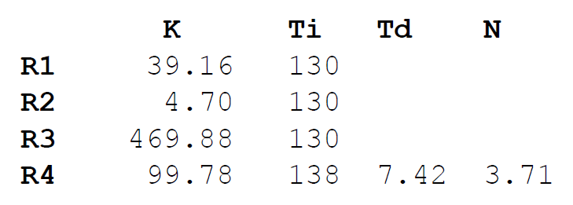

# Prove dei regolatori

**Segnali da applicare: **

- scalini di SP di `±3°C`

- scalini di LD (Q2) di `±20%`

**Caratteristiche da valutare: **

- tempo di assestamento e sovraelongazione della risposta a SP

- tempo di assestamento e massima deviazione della risposta a LD

- saturazione di CS quando la banda passante è troppo alta (`R3`) 

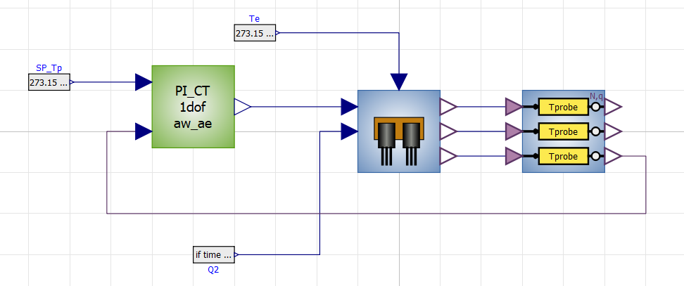

- `SP_Tp` è $y^*$

- `Q2` è il disturbo dato dall’altro transistor

- `Te` è la condizione iniziale del sistema (Temperatura dell’ambiente)

- $n$ (disturbo di misura) è simulato con il blocco `T probe` 

**Regolatore PI:**

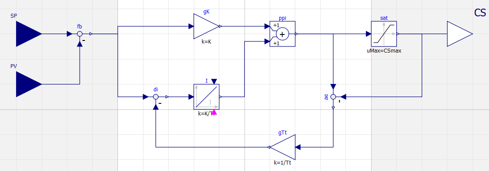

`Tt` è il parametro che gestisce l’*anti wind-up*

### Parametri Regolatore (R1)

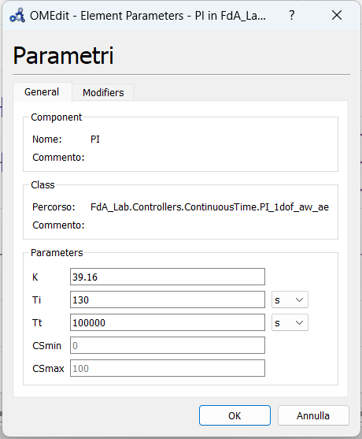

`Tt` posto alto per simulare l’assenza di anti wind-up

### Simulazione


**grafico uscita:**

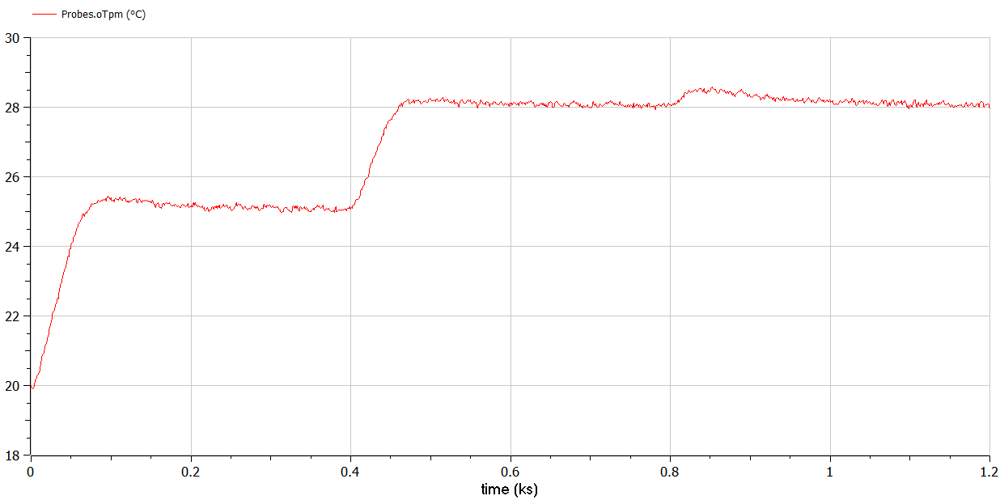

- no sovraelongazioni

- tempo di assestamento ci sta

- a $t = 800s$ risposta al disturbo `Q2`

**grafico variabile di controllo:**

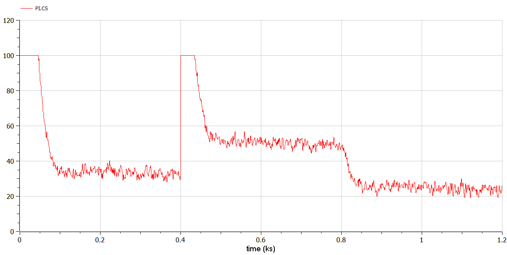

→ satura


**grafico uscita:**

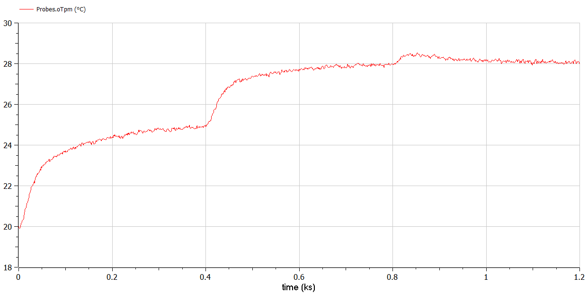

→ molto più lento

**grafico variabile di controllo:**

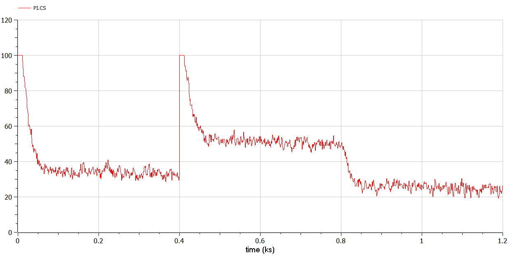

→ variabile di controllo molto meno sollecitata

### Parametri Regolatore (R3)

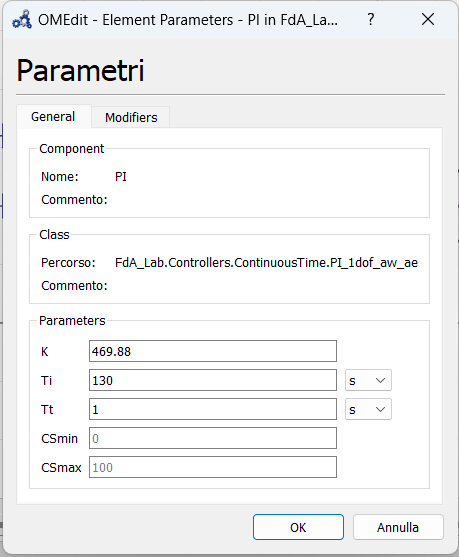

### Simulazione

**andamento variabile di controllo:**

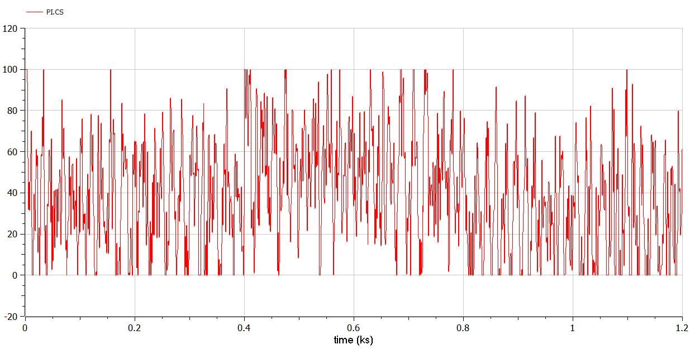

`R3` molto aggressivo: satura immediatamente e l’anti wind-up per rimediare inverte l’andamento 

### Parametri Regolatore (R4)

